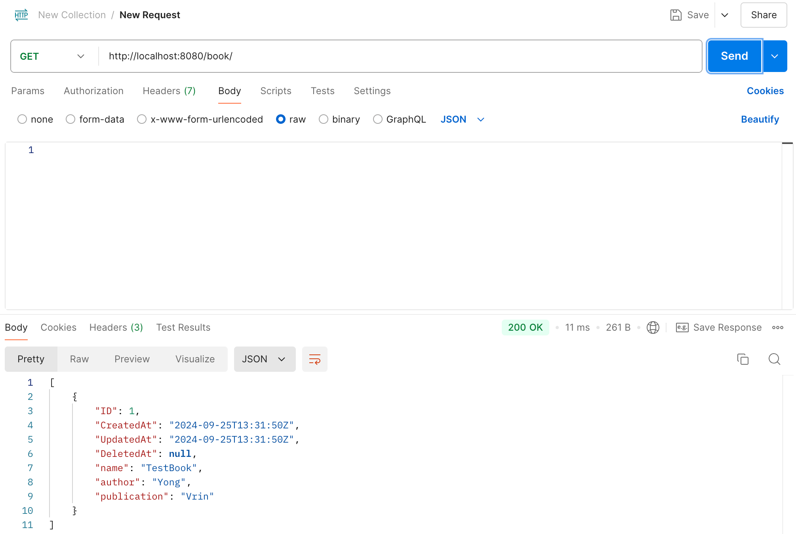

# Book Storage System

## Table of Contents
- [Overview](#overview)
- [Features](#features)
- [Installation](#installation)
- [Usage](#usage)
- [API Documentation](#api-documentation)
- [Contributing](#contributing)
- [License](#license)

## Overview

This project is a Book Storage System developed in Go. It allows users to store and manage a collection of books, including adding, updating, and deleting book records. The system provides a RESTful API to interact with the book storage and is designed to be extendable for various use cases.

## Features
- Add books with aame, author, publication, and other relevant details.
- Retrieve information on stored books.
- Update existing book records.
- Delete books from the storage.
- Simple and intuitive REST API for interacting with the system.
- Lightweight and fast, built using Go.

## Installation (with Docker) 

1. **Clone the repository**:
 ```bash
 git clone https://github.com/putongyong/go-bookstore.git
 cd go-bookstore
 ```

2. **Install Docker**:
 If Docker is not already installed on your machine, you can install it by following the instructions for your operating system:

 - [Docker for Windows](https://docs.docker.com/desktop/install/windows-install/)
 - [Docker for Mac](https://docs.docker.com/desktop/install/mac-install/)
 - [Docker for Linux](https://docs.docker.com/engine/install/)

 You will also need Docker Compose, which comes pre-installed with Docker Desktop for Windows and macOS. 
 
 **Build and run the Docker image**:
 Once Docker is installed, you can build and run the project using Docker Compose. Navigate to the project directory and run:

 ```bash
 docker-compose up --build
 ```

 This will build the Docker image for the application and start the necessary services.

4. **Access the application**:
 Once the application is up and running, you can interact with the API using your browser or API tools like By default, the app will be available at:

 ```bash
 http://localhost:8080
 ```

### Additional Docker Commands

- **Stop the application**:
 ```bash
 docker-compose down
 ```

- **Rebuild the image without cache**:
 ```bash
 docker-compose build --no-cache
 ```


## Usage
Once the project is up and running, you can interact with the book storage system via API calls. Here are some examples using postman:

- **Home page**:


- **Add a book**:


- **Get all books**:




- **Get a specific book by ID**:


## API Documentation
The system exposes the following endpoints:
- `GET /book/` - Get a list of all books.
- `GET /book/{bookid}` - Get a specific book by ID.
- `POST /book/` - Add a new book to the collection.
- `PUT /book/{bookid}` - Update details of a specific book.
- `DELETE /book/{bookid}` - Remove a book from the collection.

## Configuration
Configuration options (such as port numbers, database connections, etc.) can be adjusted by modifying the

## Contributing
Contributions are welcome! To get started:
1. Fork the repository.
2. Create a new branch (`git checkout -b feature/YourFeature`).
3. Make your changes and commit them (`git commit -m 'Add new feature'`).
4. Push to the branch (`git push origin feature/YourFeature`).
5. Open a pull request.

Please ensure your code adheres to the project's [coding standards](CODING-STANDARDS.md) and includes adequate tests where applicable.

## License
This project is licensed under the MIT License - see the [LICENSE](LICENSE) file for details.